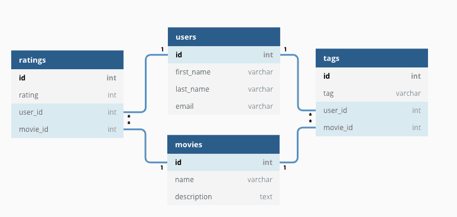
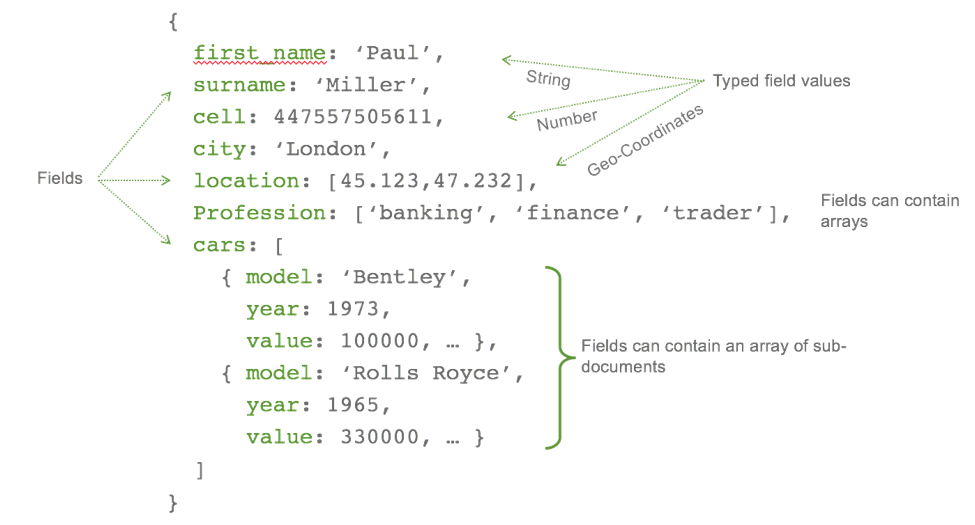
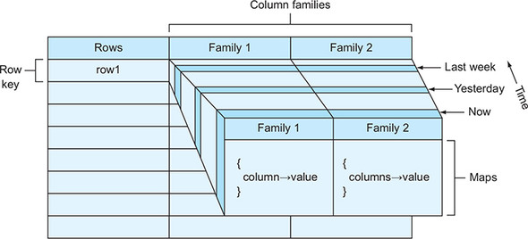
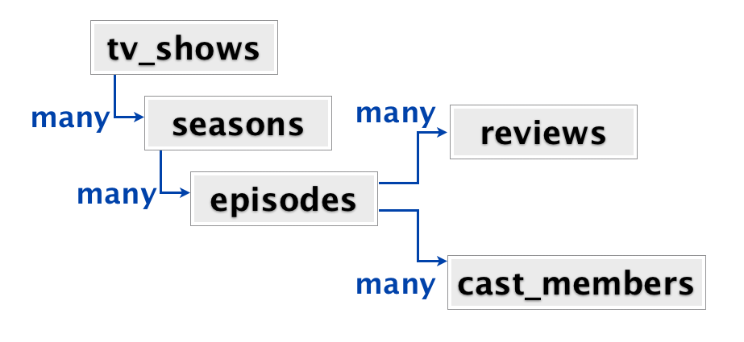
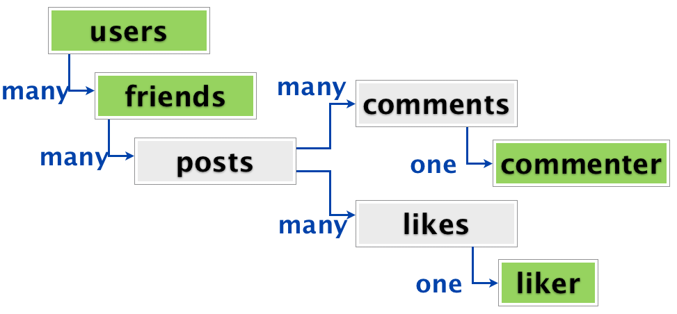
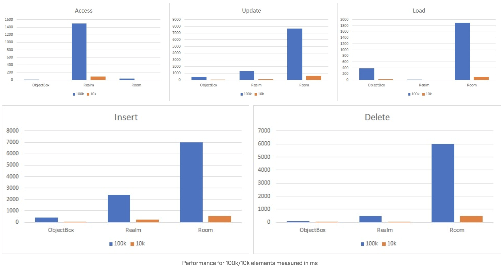

build-lists: true 
slidenumbers: true
autoscale: true

# SQL vs NoSQL 

Artur Badretdinov, Squire Technologies

---

# About me

Android Team lead with a bit of backend experience

https://twitter.com/arturstwit
https://t.me/ohmyeventbot
https://t.me/travelernote

Recently failed a design interview:
https://youtu.be/hsyTEQkaUAc

^ Поэтому, можно относиться к моим словам с долей скепсиса

---

# Databases 101
## SQL vs NoSQL 

---

# Agenda

1. SQL and NoSQL in backend development
1. SQL and NoSQL in Android development

---

# Why on Android Crew?

1. It's important to know WHY NoSQL
1. Useful for FAANG interviews
1. Useful for design interviews
1. Useful in startups

---

> Database - big box of things

^ image - box of things

---

## SQL (SEQUEL)

Structured Query Language (1970)

* Data Definition
* Data Manipulation
* Transaction Control

^SQL is not a db itself

---

SELECT COUNT (name) FROM Listeners;

---

## Database Management Systems

* Oracle - 1979
* Microsoft - 1989
* MySql - 1995
* Postgres - 1996
* SqLite - 2000

---

---

## Tables, tables, tables

* Scaling / Sharding
* Schema changes
* Performance of multi-table queries

---

---

# NoSql 

A meetup name (2009)

* Not using the relational model (not the SQL language)
* Open source
* Designed to run on large clusters
* Based on the needs of 21st century web properties
* No schema, allowing fields to be added to any record without controls

---

## Types of NoSql

* Key-value
* Document
* Wide Column
* Graph
* Time series*
* Search Engines*

---

# Key-value

Remote Dictionary (Map)
Key:Value where Value == Value

[.column]
### Usage 
* Cache
* Simple data
* Message queues
* Often in-memory

[.column]
### DBMS 
* Redis
* Memcache

---

---

# Document oriented

Key:Value where Value == Document

[.column]
### Usage 
* Higher performance for "item-based" queries
* Simpler scaling
* Implicit schema - seems easier*

[.column]
### DBMS 
* MongoDb
* DynamoDb
* Couchbase
* Firebase Realtime Db
* Firestore

^ Не рассказывать тут про схему

---

---

# Wide column (Columnar)

Key:Value where Value == Column (Column Family)

[.column]
### Usage 
* Analytics
* Data warehouses
* Per-column queries

[.column]
### DBMS 
* Bigtable
* DynamoDb
* Cassandra

---

---

# Graph oriented

Object == Node + Connection

[.column]
### Usage 
* Fraud detection
* Recommendation engines
* Identitity and Access management

[.column]
### DBMS 
* Neo4j
* Dgraph
* Cosmos DB

^ Scalability problems - not used so wide. Twitter uses Redis, Facebook - different dbms for the same data

---

# Time series dbms (Columnar)*

[.column]
### Usage 
* Sensor Data
* Tracking assets
* Predicting shopping behavior

[.column]
### DBMS 
* InfluxDB
* Prometheus
* Graphite
* Objectbox TS*

---

# Search engines (Document / Graph based)*

[.column]
### Usage 
* Searching in documents
* Natural language questions
* Fuzzy search
* ... search :)

[.column]
### DBMS 
* ElasticSearch
* Algolia
* Splunk

---

# Cloud storage*

[.column]
### Usage 
* It's not a DBMS as is
* File storage

[.column]
### DBMS 
* Goocle Cloud Storage
* Amazon S3

---

# To SQL or not to SQL?

---

# Schemaless is our future!

---

## ~~Schemaless is our future!~~

# Usually, there is an implicit schema

* User
	* id
	* name

---

## ~~Schemaless is our future!~~

# Usually, there is an implicit schema

* User
	* id
	* name
	* first name
	* last name

^ We need to somehow get them 

---

# Migrations! Even in "schemaless" nosql...

---

# There is no silver bullet!

https://habr.com/ru/post/231213/

^Есть сериал, называемый «General Hospital», который насчитывает уже 12000 эпизодов в течение 50+ сезонов. На моем ноутбуке, PostgreSQL работает около минуты, чтобы получить денормализованные данные для 12000 эпизодов, в то время как извлечение документа по ID в MongoDB занимает доли секунды.

---

# There is no silver bullet!

Users, Users, Users...

---

# There is no silver bullet!

Where is my Actor?

^ Он хочет иметь возможность кликнуть на на имя актера и посмотреть его карьеру в телесериалах. Он хочет список всех эпизодов во всех сериалах в хронологическом порядке, в которых этот актер снимался. 

---

> How Twitter Uses Redis to Scale - 105TB RAM, 39MM QPS, 10,000+ Instances.
> September 2014

---

# CocroachDB

> ACID compliant databases allow for consistent transactions. Even in a distributed environment, CockroachDB provides the highest level of isolation - serializable.

---

# OLTP and OLAP

* Online Transaction Processing
* Online Analytical Processing

---
[.autoscale: true]

# Grand finale

[.column]

* Need connections (relations)?
	* Relational DBMS
	* Graph DBMS
* Highly cohesive data without links to each other
* or just archiving a pile of stuff
	* Document DBMS
	* Object DBMS

[.column]

* Specific use-cases for different NoSql dbms
	* Data analysis
	* Search
	* Time Series
	
---

# Wait, but is that and Android Crew?

---

# Android use cases

[.column]

* *Need connections (relations)?*
	* Relational DBMS
	* Graph DBMS
* *Highly cohesive data without links to each other*
* or just archiving a pile of stuff
	* Document DBMS
	* Object DBMS

[.column]

* Specific use-cases for different NoSql dbms
	* Data analysis
	* Search
	* Time Series
	
---

# To SQL or not to SQL in Mobile?

---

# SQL or NoSql - It doesn't matter![^1]
## But other things do

[^1]: Almost doesn't, as usual

---

# Why don't we have Mobile Database Administrators?

---

## Why don't we have Mobile Database Administrators?

# We don't need to dance with CAP!

---
[.autoscale: true]

# How to choose a database (dbms)?

[.column]

* Vendor
* Business requirements
	* Local / Remote
	* Performance, number of objects
	* Security
* Tooling
* Team's experience

[.column]

* Convenience of API
	* Queries
	* Relations
	* Reactive / listening to changes
* Footprint (size)
* Criticality of the project
	* Consider something new for short-term / side project

---

# SqLite (pure) (2000)

* Relational
* Requires some SQL knowledge

[.column]
### Pros 
* Time-proven
* Great tooling, db inspector
* Nearly doesn't add size to apk
* Encryption via SQLCypher

[.column]
### Cons  
* Verbose
* Relations are relatively complex to build

^Relational is not a prons or a con, it's just a fact

---

# Room - abstraction layer over SQLite

* Internally, it's still SqLite

[.column]
### Pros 
* From Google - will likely live long time
* Great tooling
	* Syntax highlight
	* Compile time checks
* Adapters to everything
* Nearly doesn't add size to apk (50 KB)
* Encryption via SQLCypher

[.column]
### Cons  
* Relations are relatively complex to build
* Not multiplatform
* Sometime breaks incremental compilation*
* Requires instrumented tests

^ heard about it, need to check the latest case. Joke about AsyncTask and Loaders

---

# SqlDelight

* Internally, it's still SqLite

[.column]
### Pros 
* Great tooling
	* Sql autocompletion
	* Compile time checks
	* AS plugin
* Adapters to everything
* Nearly doesn't add size to apk
* Multiplatform
* Encryption via SQLCypher
* JVM unit tests

[.column]
### Cons  
* Relations are relatively complex to build
* Mostly manual migrations

---

# Realm

[.column]
### Pros 
* Nice query building api
* Easy work with relations
* Lazy evaluation mechanism
* Works with managed objects
* Constistency with IOS app
* Supports encryption
* Has browser
* In-memory db for JVM unit tests
* Can be synced with cloud

[.column]
### Cons  
* Entities must be inherited from RealmObjects
* Doesn't support Type Adapters (https://github.com/realm/realm-java/issues/1694)
* A couple of ways to shoot yourself in the foot
	* Managed objects are thread - dependendant
	* Realm instances should be opened / closed in the same thread
* 4 Mb per apk

^ The relationships are established using B+ trees

---

# ObjectBox

[.column]
### Pros 
* Fast
* Nice query building api
* Easy work with relations
* Easy migrations
* Has a browser
* Test db for JVM unit tests
* For different platforms, incl. Flutter
* Can be synced with cloud

[.column]
### Cons  
* 1,5 Mb per apk (not so bad)
* Small startup

---

# Cloud Firestore

Remote

[.column]
### Pros 
* Easy sync with the cloud
* Supports advanced queries
* High availability (99,999%)

[.column]
### Cons  
* Relatively slow for offline usage

---

# Shared Preferences

NoSql storage!!!

---

# DataStore

New version of Key-value storage.

* Preferences DataStore
* Proto DataStore

---

# Others

* Paper (NoSql-like) https://github.com/pilgr/Paper
* Couchbase-lite https://github.com/couchbase/couchbase-lite-android
* Tens of others are abandoned

* Case: Mail.ru Cloud Ios app and NoSql key-value storage: https://www.youtube.com/watch?v=-JBBlB0uTsU

---

# Perf matters

Open source benchmark: https://github.com/objectbox/objectbox-performance
Third-party post: https://notes.devlabs.bg/realm-objectbox-or-room-which-one-is-for-you-3a552234fd6e

---

---

# So what?

1. How much of relations do you need?
	1. Just quickly return cached requests
	1. Complex logic with offline work and relations between entities
1. How much of performance do you need?
	1. Storing a few hundreds or thousands objects
	1. Getting the data in bg thread vs reads from main thread
1. How often do you change your models?
	1. Can you just drop the data as cache?
	1. Do you often need to migrate schemas?
1. Do you need a remote sync?

---

#[fit]There is no silver bullet!

---

## See you later! :)

https://twitter.com/arturstwit
https://t.me/ohmyeventbot
https://t.me/travelernote

Recently failed a design interview:
https://youtu.be/hsyTEQkaUAc

---