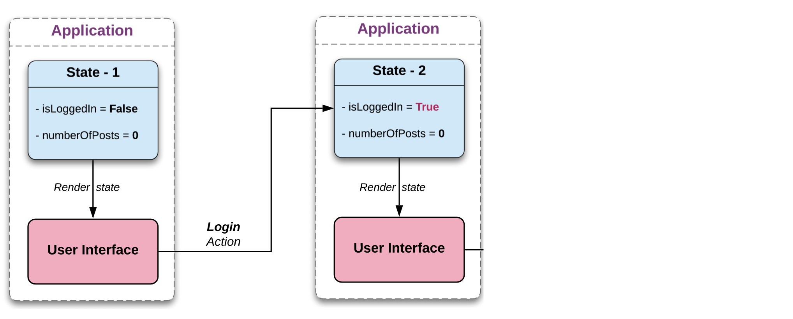
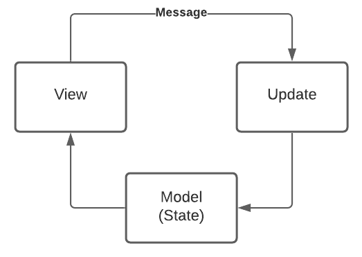

# TEA in Prod

### Artur Badretdinov, Squire

---


# Artur Badretdinov

Digital Nomad, Lead Android Developer
https://t.me/travelernote
https://t.me/ohmyeventbot

---

# The Elm Architecture in prod

---

# The goal of this talk

* Not about theory
* But about a real example

---

> Elm is a **functional** language for web apps

---

Elm Architecture is one of the UDF band

---

# Really Quick Recap [^1]

[.column]
* Unidirectional data flow
* Pure functions
* Immutability
* Higher order functions
* State machine
* Side effects

[.column]
* MVI
* TEA (MVU)
* Redux
* The Composable Architecture

[^1]: https://www.youtube.com/watch?v=FPbUAgyMPAc

---


---




---


---

# Unidirectional Flow (UDF)



---

# view = f(state)

---

#[fit] updated state = f(state, message)

---

# What do we want?

* Explicit state
* Making state handling visible
* Clear responsibilities
* Increased testability
* No flakiness
* Easy to reason about

---

# Explicit state requirements

* Same way as no platform dependencies
* No side effects in Update
* Otherwise, we can't guarantee repeatability

---

# One way to implement Model

---

# One way to implement ~~Model~~ Feature

---

# One way to implement Feature

* State
* Messages
* Update
* Commands
* Dependencies

---

# Real Unidirectional Flow (UDF)

* TODO: pic with more items here

^ Attentive listeners may have noticed that working with db or network is really a side effect

---

# State

* Contains everything needed to render the View
* Never updated manually

```kotlin
  data class State(
    val loading: Boolean,
    val movies: List<Movie>,
    val message: Text,
    val lastRequestTime: LocalTime
  )
```
---

# Messages

Whatever can lead to state change

```kotlin
  sealed class Message {
    // user
    data class SearchUpdated(val query: String, val time: LocalTime) : Message()
    data class MovieClicked(val movie: Movie) : Message()

    // system
    data class MoviesResponse(val response: Try<List<Movie>>) : Message()
```

---

# Update

Pure boy
"Old state in, new state out"

```kotlin
 fun update(message: Message, state: State)
                     : Pair<State, Set<Command>> =
    when (message) {
        is Message.MovieClicked -> handleMovieClick(message.movie, state)
        is Message.SearchUpdated -> handleSearchUpdate(message.query, state)
        is Message.MoviesResponse -> handleMoviesResponse(message.response, state)
      }
```

---

# Commands

We live in a real world
* DB
* Network
* Random

```kotlin
class GetMovies(query: String) : Message ({ deps ->
    val movies = deps.repository.searchMovies(query)
    return@single Message.MoviesResponse(movies)
})
```

---

# How to debug

1. Check what state gets to View
2. Check the `update` function calls
3. Roll back a few messages if needed

---

# Live demo
## Real app approach, 160 Fragments

Demo Repo:
https://github.com/Gaket/MvuMovieDb

---

# Other cases

* One-time events
* Navigation
* Seperate classes for UI models

---

# Imperfect world

* View is expected to be stateless
* Still we have scroll position, animations

---

# Conclusion

Not a silver bullet, but worth trying!

* Clear responsibilities
* Increased testability
* No flakiness
* Easy to reason about
* A bit more code

---

# Acknowledgements

* Tim Plotnikov, https://twitter.com/timofeipl
* Sergey Opivalov 
* Evgeniy Ekgardt

---

# Questions?

Artur Badretdinov @ Squire

Repo:
https://github.com/Gaket/MvuMovieDb

https://twitter.com/ArtursTwit
https://t.me/gaket