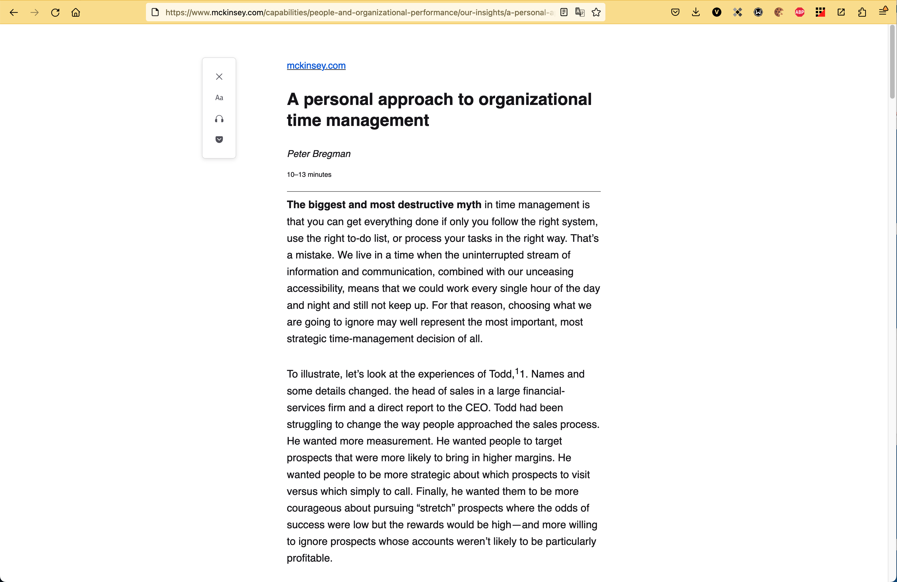

build-lists: true
slidenumbers: true
slidecount: true
slide-transition: true

## Procrastination
### Artur Badretdinov

---

# About me

* Artur Badretdinov
* Google Developer Expert
* [20+ talks last 2 years](https://github.com/Gaket/presentations)
* [20+ countries visited last](https://youtu.be/AOal6QRx2kU)
* 1 wife, 1 child
* 9 hours of sleep per day

---

---

---

# Beginning

---

# Activities

---

# GOALS!

---

# GOALS!
## Deadlines

---

---
[.background-color: #fff]

---

# Write-only

* Database
* Code
* Notes
* Goals...

---

# Agile results

[.column]

* Plan
* Execute
* Retrospect

[.column]

* Day
* Week
* Month
* Year

---

# Core practices of Agile Results

* The Rule of 3
* Timeboxing
* Triage
* [Remaining 9](https://medium.com/swlh/the-12-practices-of-agile-results-eb6e7942a2cf)

---

[.background-color: #fff]

^ Deming Circle, Toyota, 1959

---

#[fit] Procrastination

^ Who heard about Tim Urban's Procrastination talk?

---

[.background-color: #fff]

---

[.background-color: #fff]

---

[.background-color: #fff]

---

[.background-color: #fff]

---

[.background-color: #fff]

---

[.background-color: #fff]

---

[.background-color: #fff]

---

# Wait but why blog

[Why procrastinators procrastinate](https://waitbutwhy.com/2013/10/why-procrastinators-procrastinate.html)
[How to beat procrastination](https://waitbutwhy.com/2013/11/how-to-beat-procrastination.html)
[Why Generation Y yuppies are unhappy](https://waitbutwhy.com/2013/09/why-generation-y-yuppies-are-unhappy.html)
[How to pick life partner](https://waitbutwhy.com/2014/02/pick-life-partner.html)

---

---

# Distractors

* External
* Internal

---

# External Distractors

* Notifications
* Ads
* News feeds
* Colleagues
* Family
* Hunger

---

# Notifications

* TURN THEM OFF!
* Whitelist if needed
* Check out from time to time

---

# Adblock - not only for Ads!

---

---

---

---

Reading mode

---

# Context

* Separate room and clothes
* Separate computer
* Separate OS User
* Separate Browser
* Separate Tab Groups

---

## Internal Distractors

---

[.background-color: #fff]

---

# Brain fuel[^2]

* Do complex things rarely
* Do easy stuff often 

[^2]: Maxim Dorofeev [Ontiko talk](https://habr.com/ru/company/oleg-bunin/blog/348714/)
---

# Making complex simpler

* Correct tasks wording
    * Detailed
    * Start with a verb
    * Shows the first step
* Do easy stuff often 

---

# Remove energy leaks

* Zeigarnik effect
    * Task list
    * Project list
    * Calendar
    * Knowledge storage
* Tasks review

---

# Focusing

---

# Pomodoro technique

* 25 minutes work
* 5 minutes rest
    * ok... sometimes 15

^ Why it works? + This talk in Subway

---

# 52 /17 [^1]

* 52 minutes work
* 17 minutes rest
* Depends on your role

[^1]: [The Muse](https://www.themuse.com/advice/the-rule-of-52-and-17-its-random-but-it-ups-your-productivity)

^ I used to do 6, now 3-4

---

[.footer: Photo by [Cara Fuller](https://unsplash.com/@caraventurera?utm_source=unsplash&utm_medium=referral&utm_content=creditCopyText") on [Unsplash](https://unsplash.com/s/photos/long-road?utm_source=unsplash&utm_medium=referral&utm_content=creditCopyText)]

---

https://bit.ly/3MRMHx0                                                                                                                                                                                                                                                                                                                                                                                                                                                                                                                                                                                                                                                                                            

---

# Recap

1. Goals
2. Tasks
3. Distractors
4. Concentration
5. Reflection

---

# Checklist

1. Notifications off
1. Separate environments
1. Stop and Think!
1. Try Pomodoro
1. Try Agile Results

---

# Your Life in Weeks

---

