slidenumbers: true
autoscale: true
build-lists: true

# TEA in Prod

### Artur Badretdinov, Squire

---


# Artur Badretdinov

Google Developer Expert,
Director of Android Engineering at Squire

https://twitter.com/ArtursTwit
https://www.linkedin.com/in/gaket/

---

# The Elm Architecture 
## in prod for 2 years


---

[.build-lists: false]

# The goal of this talk

* Not for absolute beginners 
* Not about theory
* But about a real example

---

# Agenda

* A bit of intro
* Livecoding

---

# Live demo ahead
## Real app approach, 260 Fragments

Library + Demo Repo:
https://github.com/Gaket/GreenTea

^ There is a cherry on the cake

---

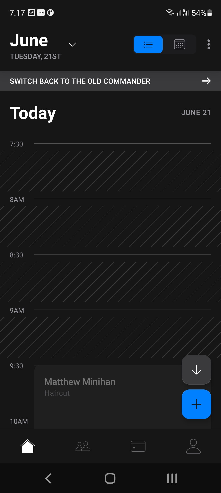
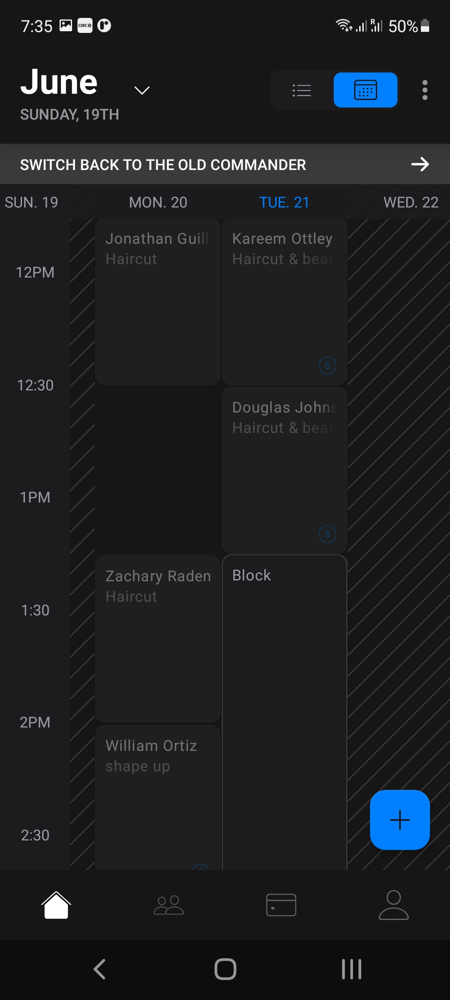
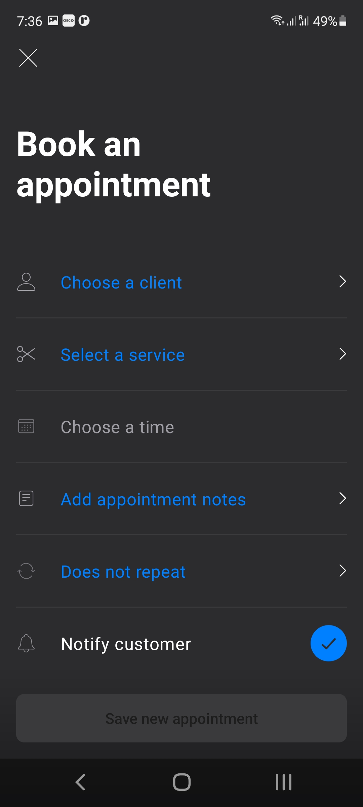

---

[.background-color: #90EE90]

# Greenfield project

---
[.build-lists: false]

# What do you want from your code?

- Easy to reason about
- Cohesive
- Testable
- Easy to find bugs

^ Blah-blah, you name it. In my opinion, you can write a nice app using any presentation pattern MVP / MVVM / MVI. But we decided to explore.

---

# What is a bug?

---

> Если пользователь видит что-то, что он не должен видеть, или не видит чего-то, что должен видеть - это баг.

^ > When a user sees something they aren't supposed to see or doesn't see something they are expected to see - it's a bug

---

> Если пользователь видит что-то, что он не должен видеть, или не видит чего-то, что должен видеть - это баг.
-- Артур Бадретдинов, во время подготовки доклада

^ > When a user sees something they aren't supposed to see or doesn't see something they are expected to see - it's a bug
-- Artur Badretdinov, while preparing this talk

^ People say that quotes make a presentation more "serious". I haven't found one for the context, so I came up with it

---

# How can we see what a user sees?

1. Look over their shoulder
1. Use session replay tools
1. Get the current screen state

^ And what's important, having an explicit state we can test exactly the state itself and not all this stuff like "verify one method called, verify other method called"

---

# How to get the current screen state?

1. MVP - try to extract state from the Android.Views
1. MVVM - find all LiveData's / Flows that the View is subscribed to
1. UDF - have an explicit state object for the View

^ This is a Pro track, so I assume you know the differences of these architectures. If not, I've seen a talk about it yesterday. MVVM - private Mutable LiveData, public immutable LiveData, underscores, no underscores - disgusting!

---

# UDF?

- Unidirectional Data Flow
- Back to at least 2014 with Facebook Flux
- [Different patterns](https://staltz.com/unidirectional-user-interface-architectures.html)
    - Redux
    - MVI
    - MVU (TEA)
    - Composable Architecture

---

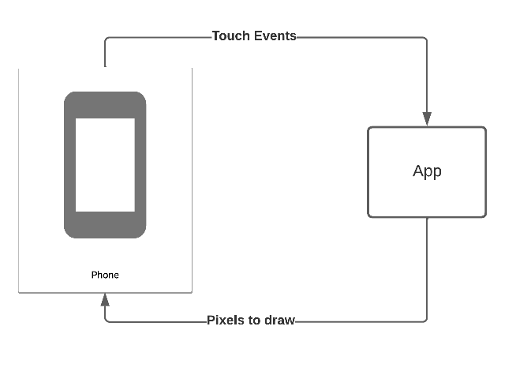

---

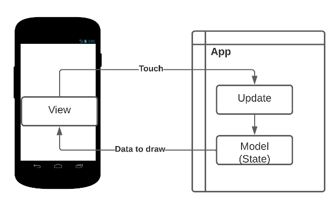

^ Arrows point in one direction - everyone is happy

---

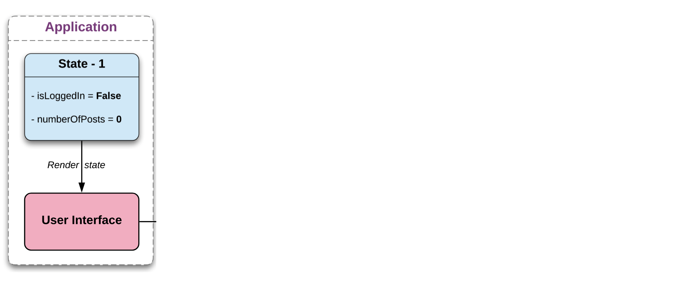

---

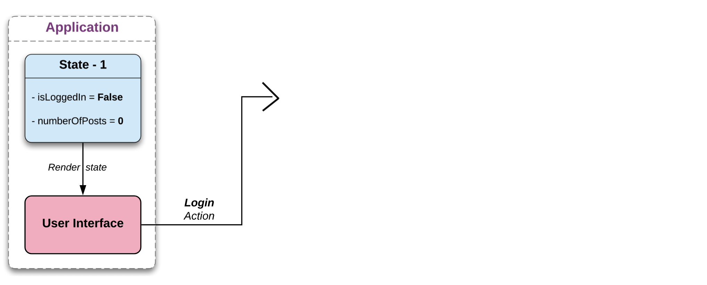

---


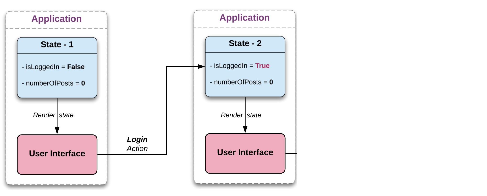

---

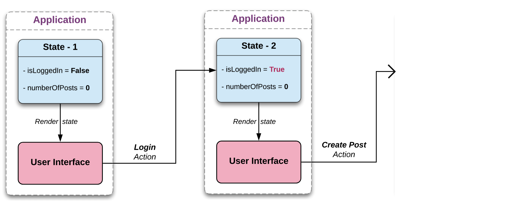

---

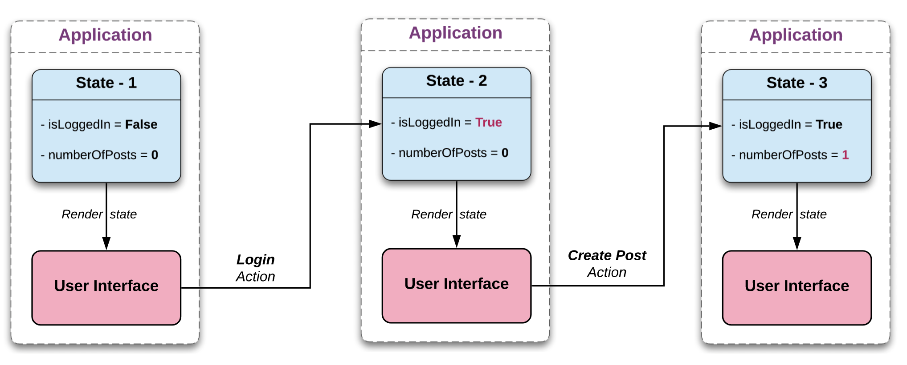

---

# Unidirectional Flow (UDF)

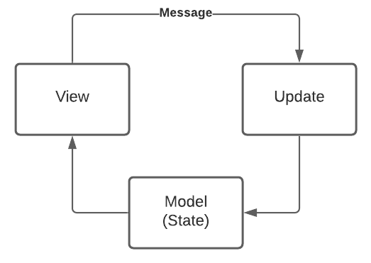

---

# Really Quick Recap

* Pure functions
* Immutability
* Higher order functions
* State machine
* Side effects

---

# view = f(state)

---

#[fit] updated state = f(state, message)

---

# MVI

MVVM with additional constraints:

1. Single state
1. Stricter rules prohibiting logic in View classes
1. Usually, based on reactive streams

---

# Our MVI experience

* [RIBs](https://github.com/badoo/RIBs) and [MVICore](https://github.com/badoo/MVICore)
* 6 months of development
* Great separation of concerns
* A lot of features
* A LOT of code
* Mocks and RxJava in tests

---

# MVU (TEA)

- MVI with explicit side effects
- MVI with hidden event flows

---

> Elm is a **functional** language for web apps

^ That's why we have so many works like pure functions and side effects

---

# One way to implement Model

---

# One way to implement ~~Model~~ Feature

---

# One way to implement Feature

* State
* Messages
* Update
* Effects
* Dependencies

---
[.build-lists: false]

# First approach, MVICore

[.column]
1. Feature
    1. State
    1. Wish
    1. Effect
    1. News
    1. Bootstrapper
    1. Actor
    1. Reducer
    1. Post Processor

[.column]
1. View 
    1. ViewModel
    1. ViewEvent
1. Binder
1. Middleware
1. Mappers
    1. StateToViewModel
    1. ViewEventToWish
    1. ViewEventToAnalytics

---

# MVU (Model - View - Update)


---

# Real-world MVU

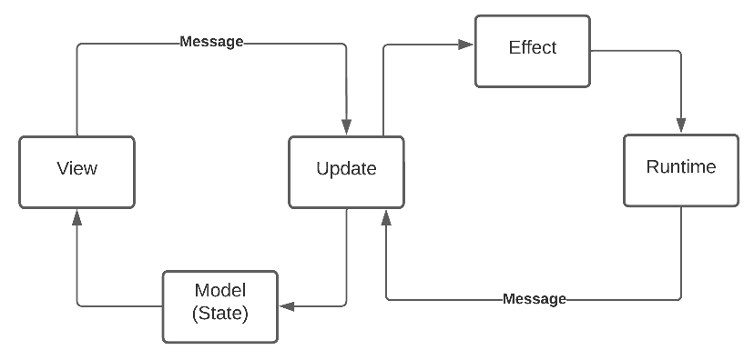

^ Attentive listeners may have noticed that working with db or network is really a side effect

---

# Real-world MVU

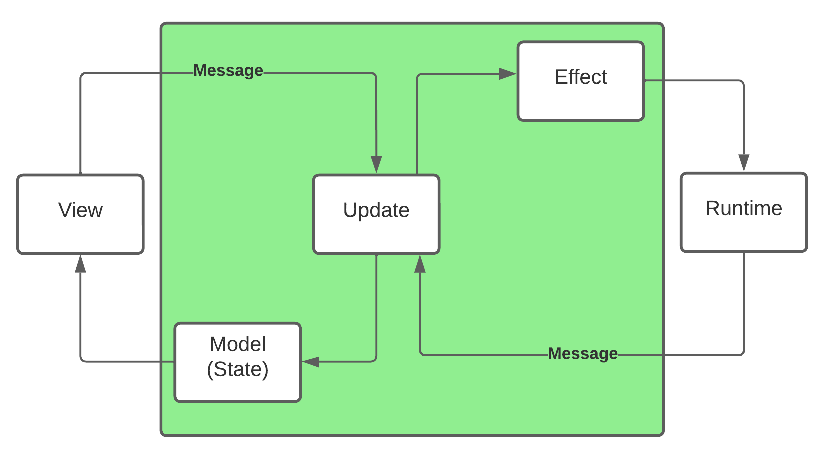

^ Attentive listeners may have noticed that working with db or network is really a side effect

---

# State

* Contains everything needed to render the View
* Never updated manually

```kotlin
  data class State(
    val loading: Boolean,
    val movies: List<Movie>,
    val message: Text,
  )
```

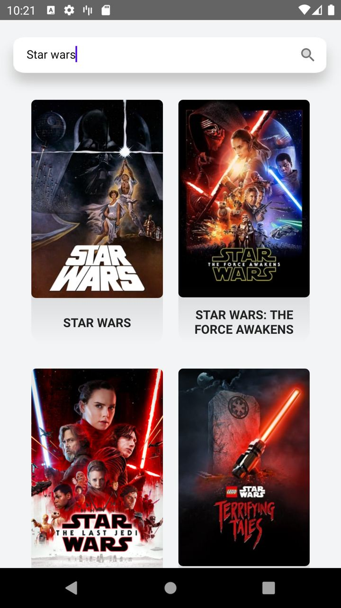

---

# Messages

Whatever can lead to state change

```kotlin
  sealed class Message {
    // user
    data class SearchUpdated(val query: String, val time: LocalTime) : Message()
    data class MovieClicked(val movie: Movie) : Message()

    // system
    data class MoviesResponse(val response: Try<List<Movie>>) : Message()
  }
```

---

# Update

Pure boy
"Old state in, new state out"

```kotlin
 fun update(message: Message, state: State)
                     : Pair<State, Set<Effect>> =
    when (message) {
        is Message.MovieClicked -> handleMovieClick(message.movie, state)
        is Message.SearchUpdated -> handleSearchUpdate(message.query, state)
        is Message.MoviesResponse -> handleMoviesResponse(message.response, state)
      }
```

---

> Keep View stupid!
-- MVP

---

> Keep View and Side Effects stupid!
-- MVU

---
[.build-lists: false]

# Effects

* DB
* Network
* Random

```kotlin
class GetMovies(query: String) : Message ({ deps ->
    val movies = deps.repository.searchMovies(query)
    return@single Message.MoviesResponse(movies)
})
```

---

# Live demo
## Real app approach, 260 Fragments

Demo Repo:
https://github.com/Gaket/GreenTea

---
[.build-lists: true]

# How to debug

1. Check what state gets to View
2. Check the `update` function calls
3. Roll back a few messages if needed

---
[.build-lists: true]

# Logs

```
18:00:00 Init: State {...}
18:00:03 Message: OnMovieClick(Movie(...))
18:00:03 Render: State {...}
18:00:04 Message: OnMoviesResult(Movies(...))
18:00:04 Render: State {...}
```

---

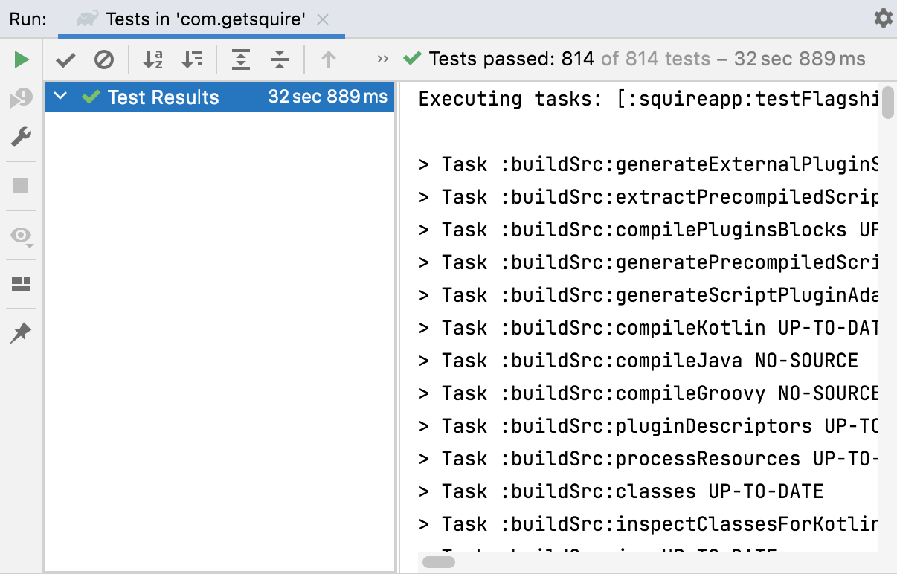
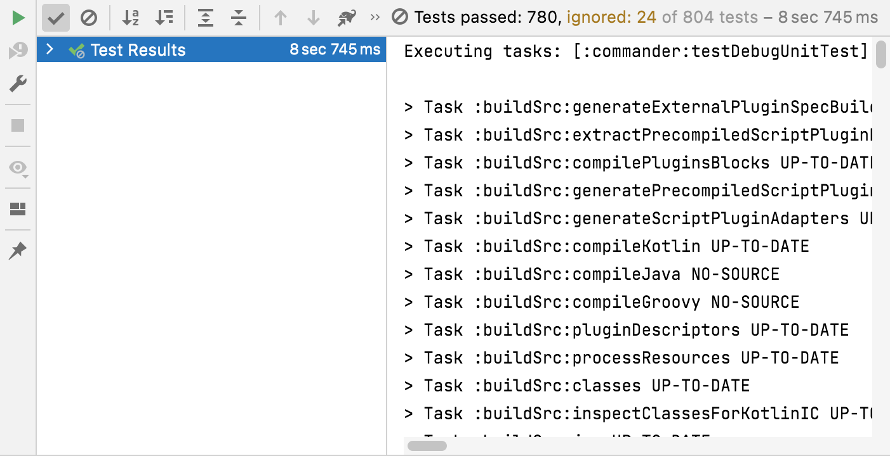

---

# Other cases

* One-time events
* Navigation
* Separate classes for UI models
* Compose for View

---

# Imperfect world


[.column]
```kotlin
  data class State(
    val loading: Boolean,
    val movies: List<Movie>,
    val message: Text,
  )
```

[.column]
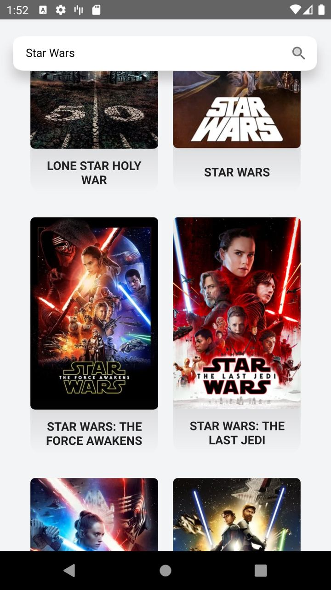

---

# Imperfect world


[.column]
```kotlin
  data class State(
    val loading: Boolean,
    val movies: List<Movie>,
    val message: Text,
  )
```

[.column]


[.column]
* View is expected to be stateless
* We still have scroll position, animations, Toasts, minimal time to show a loading bar

---

# Conclusion

Not a silver bullet, but worth trying!

* Clear responsibilities
* Increased testability
* Ability to run integration tests with backend but without UI
* No flakiness
* Easy to debug / reason about - one input, one output
* Perks like Time Travel / State Restore (exist in MVI too)

---

# Main drawbacks

* A bit more code
* Action handling code is split into different chunks
* Some learning curve for new devs

---

# Never-ending battle

* Badoo moves away from RIBs[^10]
* Square migrated through 4 architectures [^11]
* How to model State [^12]

[^10]: https://www.droidcon.com/2022/09/29/model-driven-navigation-with-jetpack-compose-from-zero-to-hero/

[^11]: https://www.droidcon.com/2022/09/29/migration-without-migraines-automatic-migration-at-scale/

[^12]: https://mobius-piter.ru/2021/spb/talks/4wrmwp7kpzqzfxxuez5qq9/

---
[.build-lists: false]

# Acknowledgements

* Tim Plotnikov
* Sergey Opivalov 
* Evgeniy Ekgardt
* Mikhail Gurevich
* Nicolas Mottin

---

# Questions?

Artur Badretdinov @ Squire

Repo:
https://github.com/Gaket/GreenTea

https://twitter.com/ArtursTwit
https://t.me/gaket


--- 

If we had more time... Testing!

---

What matters the most?

1. App's data and logic
1. Elements on Screens
1. Data on Screens
1. Navigation between Screens

---

User experience!

---

> Don’t fix bugs later; fix them now
-- Steve Maguire

---

# Double-entry bookkeeping

^ is the concept that every accounting transaction impacts a company's finances in two ways. The general ledger is the record of the two sides of each transaction. Double-entry bookkeeping says each accounting transaction has two sides.

---

# Testing MVP

```
presenter.onAction()
verify(testView.doA())
verify(testView.doB())
verify(someRepo.wasCalled())
```

---

# Testing MVVM

```
///
/// a lot of prep code to test LiveData / RxJava / Coroutines
///
viewModel.onAction()
assertThat(firstLiveData.value).isTrue
assertThat(secondLiveData.value).isNull
verify(someRepo.wasCalled())
```

---

# Testing MVU

```
val (viewState, effects) = feature.update(prevState, message)
assertThat(viewState.isLoading).isTrue
assertThat(viewState.error).isNull
assertThat(effects).contain()
```

---

Backup Slide:

# View

```kotlin
class MoviesFragment {
 override fun initDispatchers() {
    binding.searchInput.afterTextChanged { query ->
      dispatch(MoviesFeature.Message.SearchUpdated(query, LocalTime.now()))
    }
  }
   override fun render(state: MoviesFeature.State) {
    if (state.loading) {
      binding.searchIcon.visibility = View.GONE
      binding.searchProgress.visibility = View.VISIBLE
    } else {
      binding.searchIcon.visibility = View.VISIBLE
      binding.searchProgress.visibility = View.GONE
    }
   }
}
```

---