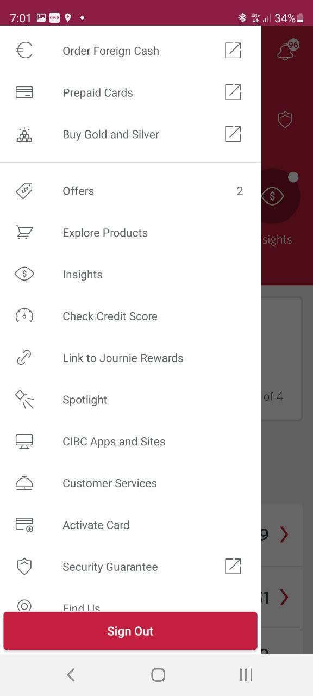
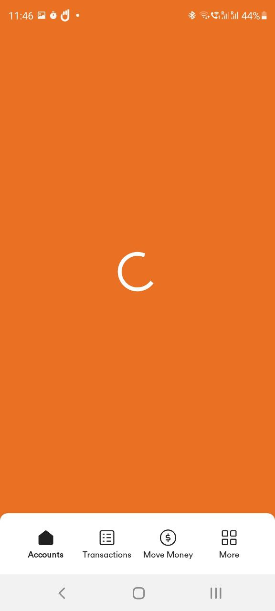

slidenumbers: true
build-lists:true
autoscale: true

The Macro UX And UI Patterns Among Customers In Different Countries: Understanding The Role Of “Super Apps” In The Digital Payments Ecosystem

^ Hi! My name is Artur and I'd like to decrease the degree of seriousness of this conference. Hopefully, you'll like it and I won't be punished by organizers :) I'm in a shirt first time since my wedding... that was quite a while ago

---

The Macro UI And **UX Patterns** Among Customers **In Different Countries** : Understanding The Role Of **“Super Apps”** In The Digital Payments Ecosystem

^ My friends from the conference helped me to come up with such an intricate talk ti  tle that I can't even read it, so let me highlight a few things

---

# About me

Director of Android Engineering at Squire
Google Developer Expert
Developed a banking app on Android
User of 15 banks
Born in Russia, resident of Canada

^ Context  matters

---

[.build-lists:true]

# Agenda

1. A few Millenial notes on banking apps (Subjective)
1. Evolution of banking apps in Russia (Objective)
1. Superapps vs Ecosystems (Motivational)

^ Subjective and Objective. I'm in my thirties

---

[.build-lists:true]

# UX of an "Open an account" feature

1. No preauthorized zone in the app. "Go to the site"
1. Pre auth zone with a multi-step Choose an account feature.
1. In-app progress of application + Notifications
1. Virtual card after approval

^ The chicken or the egg dilemma. Apartment - Bank - Apartment. Ok, I found a way to use airbnb for my proof of address

---

# User experience depends on the app navigation

---

# Hamburger Menu vs Bottom Tabs

 

^ https://bytes.grubhub.com/from-drawer-to-bottom-nav-bar-a1828a079048 
TODO: hide my last name

---

> The downside of being able to show a lot of options is that you can show a lot of options. 
-- Mike Stern, Apple User Experience Evangelist[^1]

[^1]: http://blog.manbolo.com/2014/06/30/apple-on-hamburger-menus

---

---

## Hamburger Menu ->
## "Junk Drawer"

^ http://blog.manbolo.com/2014/06/30/apple-on-hamburger-menus

---

---
[.autoscale: true]

> Discoverability is cut almost in half by hiding a website’s main navigation. Also, task time is longer and perceived task difficulty increases.
-- Nielsen Norman Group[^2]

[^2]: https://www.nngroup.com/articles/hamburger-menus/

^ That's why if you check out existing views in iOS eevelopment, you'll see tabs but you won't see the Drawer

---

^ # Bottom tabs TODO: add scrim on the screens

---

^ User exp suffers. TODO: add the video

---

# To conclude

1. Think about the first impression
1. Be mindful about app navigation
1. Follow UX guidelines

---

# Evolution of banking apps

^ 9 minutes. I'd like to present you a little bit more objective data. I will not talk about the fact that almost 60% of the world traffic comes from mobile. Tinkoff founded in 2006. About 3 minutes and I'm here.

---

# Markswebb 2012 - 2022 Mobile Banking Ranking

* Traditional Bank
* Digital Office
* Ecosystem Core / Superapp

^ My personal notes may be a bit too subjective, so let's use data of a UX-research firm, Questionnairs
User interviews
UX studies 
TODO: graph of shifting

---

## 2012. The baseline - "Traditional bank"

Features:

* Accounts list
* Transactions list
* Bill Payments
* Templates
* In-bank transfers

^ TODO: replace by a pie chart on the right 

---

# 2013-2016. Evolution of banking apps

* App as a Sales Channel:
 - opening savings accounts, GICs, credit cads
 - both for existing and new clients
 - virtual card rigth after approval

---

# 2013-2016. Evolution of banking apps

* Online chat with support
 - ML-based answers for support
 - No timeouts when a robot answers you!
* VoIP calls
* Feature search

^ TODO: maybe find an animation of a robot with timeout.  video of HSBC MOBA with delayed answers

---

# 2013-2016. Evolution of banking apps

* Automatic verification code population
 - Push notifications
 - Cost saving
 - Push first, sms as a backup

---

# 2017 - 2019. Digital branch

* Insurance
* Investment
* Account-related documents
* Personal data changes
* Consultations
* Restoring access

^ Implementing this features, especially if you have a big portion of yonger clients, reduces the load on branches a lot. As a result, it scales better. A customer from a small village gets almost the same level of service as a customer living in a Metropolis

---

---

# What's next?

---

# Ecosystems vs Super Apps

---

# 2019 - 2022. Ecosystem Core

* Universal Bank id
* Cinema, Theater, Sport
* Travel
* Music and video subscriptions
* Service subscriptions
* Telecommunications providers
* Interaction with government

^ Bank id enables seamless integration to pay for other services. Cellular cervices based on virtual networks. 

---

---

# Superapps

[.column]
* AliPay
* WeChat

[.column]
* Messaging
* Money transfer
* Payments
* Food delivery
* Taxi
* ...
* Apps Marketplace

---

> AliPay and WeChat have as many users using payment services as a sum of Top-12 Chiniese banks[^5]
-- Markswebb

[^5]: https://medium.com/markswebb/why-did-banks-in-india-and-china-lose-50-of-clients-8544c3f3b7a4

---

---

---

# Food for thought

* Mobile app - a commodity
* Customers expect high level of usability and feature completeness
* Advanced app may be a competitive advantage on a developing market
* Instant money transfer is possible for usual banks

^ The mobile app became a commodity long time ago. Customers expect the same high level of usability and feature completeness from both the neobanks' and the classical banks' apps. At the same time, having a more advanced and user friendly app may be a competitive advantage on a market that is not highly developed yet. There are some financial institutions that put a bet on that, such as Neo Financial.

---

# Thank you for your attention!

---

---

# Backup slides

---

# About me

User of 8 banks in Russia
User of 5 banks in Canada
User of a couple UK neobanks

^ Context  matters

---

# Bottom tabs notes 

---

---

> Use a tab bar only to enable navigation, not to help people perform actions. [^3]
-- Apple Human Interface guidelines

[^3]: https://developer.apple.com/design/human-interface-guidelines/components/navigation-and-search/tab-bars/#best-practices

---

# Exception?

^ 10.5 minutes here

---

^ 10.5 minutes here. TODO: change Navigation icon

---

# First online-only banks (Neobanks)

Tinkoff Bank (Russia) - 2006
Chime (US) - 2012
N26 (Germany) - 2013
Atom (UK) - 2013
Monzo (UK) - 2015
Revolut (UK) - 2015

^ Some of these banks 

---

# List of features

---

# 2013-2016. Evolution of banking apps

* App as a Sales Channel
* Online chat with support
* "News feed" for all accounts
* In-app registration
* Push messaging
* Transfers to other banks
* ATM map
* Biometrics

^ Economy of millions

---

# 2013-2016. Evolution of banking apps

Ability to order a new card / bank product
Connect new card in Apple/GooglePay before it arrived
Transaction dispute

Online chat

Spendings analytics

By period
By category
Diagrams and budgets

---

# 2013-2016. Evolution of banking apps

* "News feed" for all accounts
 - Total balances
 - Transactions from different account

^ Example of a use case - to see how money are moved between accs, handling different cards

---

# 2017

Fines, utility bills subscription
Reminders
Setting card limits, freezing a card
QR code to withdraw money
Requesting statements for time period
New client registration
Changing pin code
Service search
"Stories"

https://www.youtube.com/watch?v=eRxaLE2uIvg

---

# 2018

Digital banking -> Digital office

SMS -> push notificaitons
New clients can request the first card or credit
Investments view
Insurance + voucher in the app 
In-app user education

^ Sms to push - savings of millions and auto input

---

# Chat use cases

Forming statements
Transactions for the period from the account opening
Transactions filters and search

---

# Must have

Card lock / unlock / limits
Virtual cards or card info

---

# More ideas

Collaborative transactions engagement raises user activity and account balance

Neobanks bet on easing and automating collaborative actions: they offer split-the-bill services, crowdfunding links with built-in Apple Pay and Google Pay, and sharing accounts.

The community used for customer help saves resources

One of the distinctive features of neobanks is the lack of complete customer support: most of the user goals are already automated or can be solved by the user itself. The big bet is made on a community that answers questions on forums and replaces the first line of support.

Self-service and self-resolution are also achieved by developing a well-stocked knowledge base: it’s integrated within forums, offers cards or video instruction formats. Some neobanks like Revolut Business land users on FAQ pages as the first step of troubleshooting.

Several neobanks of Europe and the US consider subscription management as their killer feature. The bank identifies regular charges with the same amount, then matches them with its own external services database and marks these charges as “Subscriptions”. This is the way users see their subscriptions and their share of expenditure, also they can cancel the subscription.

Markswebb
