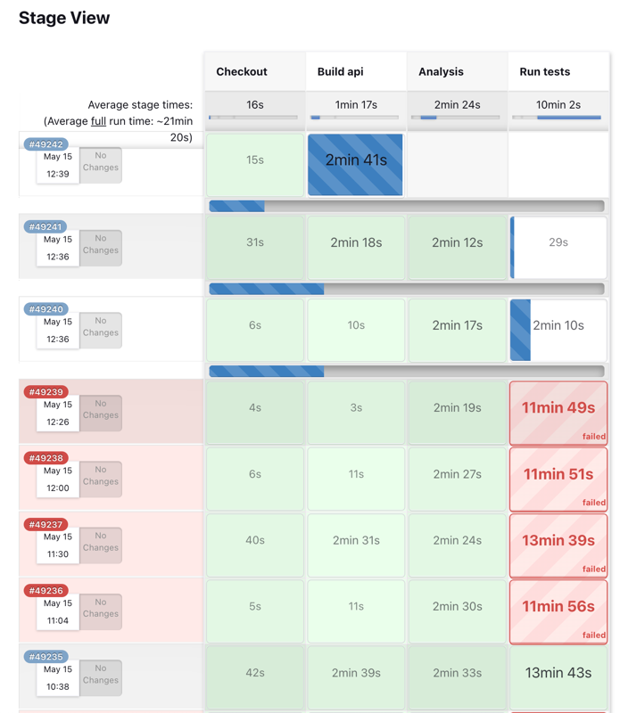
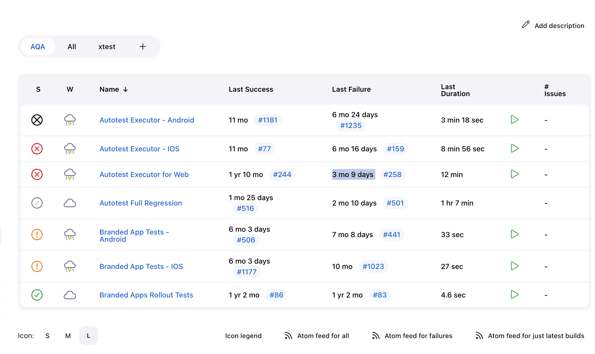

autoscale: true
build-lists: true
slidenumbers: true
slidecount: true
slide-transition: true

# Intro

* Spent an hour
* Quality Management course in my Masters
* Interacted a lot with QA on previous jobs
* Watched tens of Quality-related talks with my wife

^ You valued my energy and feedback, here is it. And I've started it last week before your Monday presentation

---

# Testing at COM, observations 

* Bottleneck for COM team
* I don't set priorities to QAs in the team
  * They often get distracted to backend / web regressions
* I'm not aware of any mobile / web automation that is up and running
    * There is a small set of E2E Android tests that should be added to a pipeline and we are almost there
    * There are 2k of unit tests on Android - we are good there. A few on iOS, working on it.

---
 
# Challenges

* Flacky tests on the backend. 8 runs for a green one!

---

# Challenges

* No E2E test pipelines that devs are aware of
    * But we have some unit tests on android, integration backend, unit/integration web

---

# Challenges

* Long execution time for PR tests, lack of parallelisation
* Poor reporting
* Absence of flaky tests handling
* 3 SDETs, 4(5) platforms x 3 projects = 15 things to test + at least 4 challenges to solve in addition to testing

^ 17 mins for backend tests

---

# Goal

* Free up SDETs time from manual testing to work on
    * Test pipelines
    * Test stability
    * Test reporting
    * Intro of different test types, including mocked web, etc
    * Increasing test coverage
    * Perf and Load testing

---

# Potential solutions

* Involve devs in writing E2E tests for ~10% of their time. 
    * To reduce amount of raw untested features produced within a sprint that will reduce scope for manual qa + SDETs
    * To increase the automation coverage
    * To make sure that the code devs write is testable
    * Similar to writing prod code so shouldn't be too far away from what they do
* Make one-time effort on building up initial test suite to free up SDETs
* Outsource

---

# Demo 

---

# Svetlana Kuzmina

* Already done contract QA work for Squire
* 5+ years of experience
* Experienced in writing automated tests for Web and Api
    * Cypress, RestAssured, Selenium
* Strong in manual testing
* Basic skills of test infra set up
* Prefers 30 h/week workload
* Open to full-time employment

[LinkedIn](https://www.linkedin.com/in/svcatt/)

^ Let's say I'm here manager. She is shy

---

# Proposal

* Svetlana can provide monthly service for building X amount of Web E2E or integration tests based on TestRails specs, billed by an invoice. 
    * Not an employment, simpler in terms of paperwork
    * Not spending time on different meetings
    * Can be easily cancelled when we meet the required coverage level / decide to shift funds somewhere

* Goals:
    * SDETs can concentrate on infrastructure and mobile platforms
    * SDETs won't be pulled for manual testing
    * Devs won't have to write those e2e tests
