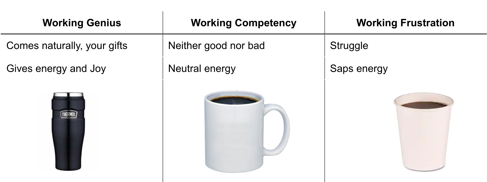
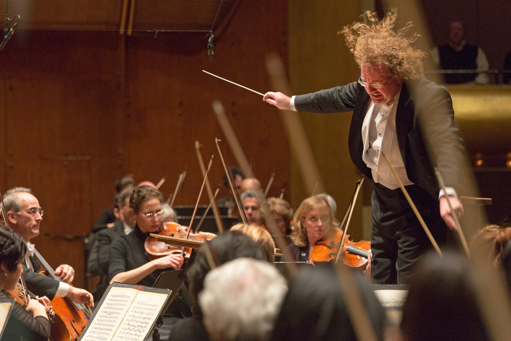
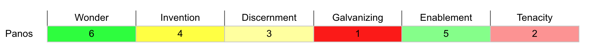
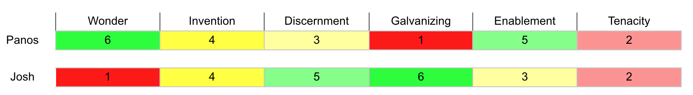
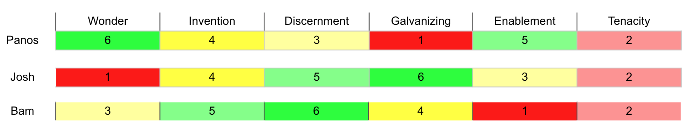

build-lists: true

# Working Genius 

---

Agenda

1. What is Working Genius?
1. The 6 types of Working Genius
1. Examples
1. Benefits
1. What comes next?
1. Q&A

---

#KCDC
## Kanzas City Dev Conf

---

# What is Working Genius?

* Concept by Patrick Lencioni
* Framework for identifying natural work talents
* Enhances productivity and job satisfaction
* Six "genius" types reflecting work preferences and strengths

^ The Working Genius model is a concept developed by renowned author Patrick Lencioni.
It's a framework that helps us identify our natural talents and preferences at work.
The model suggests that we all have specific areas where we excel, and understanding these can increase both our productivity and job satisfaction.
The concept breaks down work into six "genius" types and identifies where we are most naturally gifted and energized.

---

# The 6 Types of Working Genius

* Wonder
* Invention
* Discernment
* Galvanizing
* Enablement
* Tenacity

^ Each type represents a different aspect of work where individuals can excel. "Wonder" is about asking the right questions and recognizing the need for change or innovation. "Invention" refers to creating original and novel ideas or solutions. "Discernment" is the ability to evaluate or judge ideas and solutions. "Galvanizing" refers to the capability to rally and mobilize others, bringing ideas and plans to action. "Enablement" is providing direct support to turn ideas into reality. Finally, "Tenacity" is the drive to see things through to completion and ensure results are achieved.

---

# What brings me energy?

---

# Example profile - me

// TODO: my geniuses here

---

# Personal Benefits

* Better self-understanding
* Stress reduction
* Personal growth

^ Knowing your areas of genius can help you understand what energizes you and what drains you at work, providing better self-understanding. It can guide you towards roles and tasks that you're naturally inclined towards. By aligning your work with your natural talents, you can reduce stress and avoid burnout.

---

^  And as a manager, I may help in prioritizing you utilizing your strenghts when we work as a team.

---

---

---

---

# Team Benefits

* We'll understand each other better
* No more square pegs in round holes
* Making the most of our small team
* Conflict reduction
* More "Aha!" moments
* We'll enjoy our work more

^ This Working Genius thing isn't just a fancy theory – it's got real practical benefits for us. First off, we'll understand each other better. We'll know who's best for what job, so no more trying to fit square pegs in round holes. We're a small team, so making the most of everyone's strengths is super important. Plus, this could even help reduce conflicts because we'll understand why people think and act the way they do. And who knows, maybe it'll lead to more of those "Aha!" moments when everything just clicks into place about why your colleagues do something one way or another. And, hopefully, all of this leads to a better enjoyment from the process!

---

# How to understand your Working Genius

* Take the Working Genius Assessment
* Learn about the model
* Reflect on your work experiences

^ The first step in understanding your working genius is to take the Working Genius Assessment, a tool developed by Patrick Lencioni's team. Additionally, reflecting on your past work experiences and discussing your experiences and the assessment results with peers and mentors can provide further insight.

---

# Remarks

* The goal is to spark conversations
* It's not a decision making tool
* Assessment takes 10-15 minutes 

---

# What Comes Next?

* Team members to take the Working Genius Assessment
* Team discussion to understand and utilize everyone's geniuses
* Periodical check-ins to ensure continuous alignment

^ Squire is sponsoring everyone in the team to take the Working Genius Assessment. Following this, we'll have a team discussion to understand and utilize everyone's geniuses. We'll also have regular check-ins to ensure continuous alignment and make the most out of our collective strengths.

---

# Q&A

^ Now, I'll take any questions you may have. If you think of more questions later on, feel free to reach out to me directly or bring them up in our upcoming team discussion.