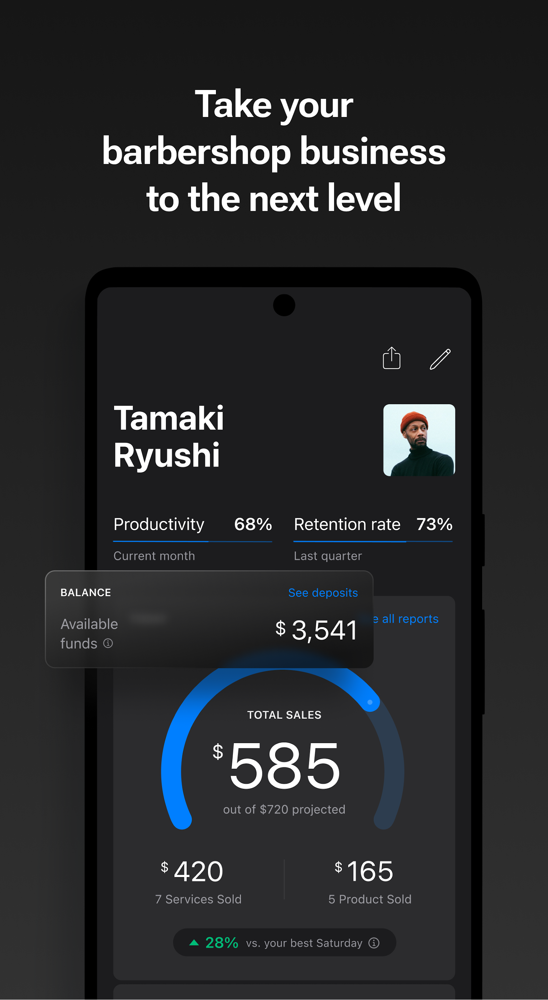

build-lists: true
slidenumbers: true
slidecount: true
slide-transition: true
autoscale: true


# Forget SQL! Create your own AI Data Analyst
### Artur Kuzmin

--- 

# Squire



^ bookings and stuff

---

# Questions

- “How many rental barbers we've got in the last 30 days?”

- “I need a test account: a commission barber in New York with over 30 bookings last week.”

- “What are the most common types of SMS we send?”

- “Find me a barber with email someemail@gmail.com”

---


# Artur Kuzmin

Director of Engineering at Squire,
Google Developer Expert

[linkedin.com/in/arturkuzmin/](linkedin.com/in/arturkuzmin/)
[twitter.com/ArtursTwit](twitter.com/ArtursTwit)


---

### Solution

## AI Data Analyst you can chat with

---

# The goal of this talk

- Build an AI Data Analyst that:
- knows your db structure 
- knows your companies context
- can answer questions about your data

---

# Tooling highlights:

- Google Ai Studio
- Bigquery
- Kaggle
- Google Colab

---


^ Companies have data. Big data, small data - doesn't matter. The important part is that many people want to get an answer for a question.

---


---

# Writing SQL queries

```sql
SELECT *
FROM barbers
WHERE created_at > '2024-01-01'
```

---

# Writing SQL queries

- Requires an interface to run queries
- Another app to juggle
- Requires knowledge of SQL
- Learning curve

---

# AI Data Analyst

- Works in Slack
- Returns an answer
- Still returns the SQL query

---


# Part 1: Ask a chat bot to generate SQL


```
- Write me an sql query to get a rental barber
from my db
```

^ 9 minutes

---

# Part 1: Ask a chat bot to generate SQL

```
- Write me an sql query to get a rental barber 
from my db

- To provide a precise SQL query, we need more 
information about your database schema...
```

^ Column names, table names

---

# Part 1: Ask a chat bot to generate SQL

```sql
SELECT *
FROM barbers
WHERE is_rental = 1;
```

---

# Part 2: Provide table structure

```
Write me an sql query to get a rental barber
from my db.

My barbers table has the following columns: 
id, name, shop_id, created_at

The shops table has shops.kind column which is 
0 for rental and 1 for commission
```

---

# Part 2: Provide table structure

```sql
SELECT *
FROM barbers
  JOIN shops ON barbers.shop_id = shops.id
WHERE shops.kind = 0
LIMIT 1;
```

---

# 225 tables

---

# 225 tables
## 600,000 tokens

^ How many tokens can Gemini ready? Chat GPT? Anthropic?

---

# Google AI Studio


---


^ For smaller projects it may be all you need as an Engineer

---


---


---


---


---


---

# Gemini Free tier

| Limit Type | Gemini 1.5 Pro | Gemini 1.5 Flash | 
| --- | --- | --- | 
| Requests per minute (RPM) | 2 | 15 | 
| Tokens per minute (TPM) | 32,000 | 1,000,000 | 
| Requests per day (RPD) | 50 | 1,500 | 

---

# Gemini Pay-as-you-go


| Pricing Type | Gemini 1.5 Pro | Gemini 1.5 Flash |
| --- | --- | --- |
| Input* (per 1M tokens) | $1.25 | $0.075 |
| Output* (per 1M tokens) | $5.00 | $0.30 |
| Context Caching (per 1M tokens) | $0.3125  | $0.01875 |


^600k ~70 cents

---

# AI Studio Free tier

---

## AI Studio is
# Free

---

# AI Studio

- Experiments
- Prompt Gallery
- Model tuning

---

# BigQuery Copilot

^ Bonus point - you can query it straight away!

---

# BigQuery

> BigQuery is a fully managed, AI-ready data analytics platform that helps you maximize value from your data.

---


---


---


---

# BigQuery free tier 

- 10 GB storage
- 1 TB of queries per month
- Gemini is Free w/o billing account

---

# Kaggle Notebooks + BigQuery


---

# AI Analyst

1. Receive a question
2. Generate SQL
3. Execute SQL query
4. Display the results

---

## How to give the tables structure?

---

# RAG
## Retrieval Augmented Generation

---
[.code-highlight: all]
[.code-highlight: 2-6]
[.code-highlight: 9-12]

# RAG - Langchain

```
self.prompt = PromptTemplate.from_template("""
Given the following database schema:
{context}

Generate an SQL query to answer this question{question}
Return only the SQL query without any explanation.
""")

sql_query = self.llm_chain.invoke({
         "context": context,
         "question": question
     })
```

^ TODO: add line highlighting

---

# Vanna AI

- Can be connected to any* db
- Can be connected to any LLM api
- Has a few pre-created UIs

^ 30 minutes

---

# Vanna AI

- `vanna.create()`
- `vanna.connect()`
- `vanna.train()`
- `vanna.ask()`

---

# Kaggle notebook 

Start using it now!
[pxl.to/ai-analyst](https://pxl.to/ai-analyst)


---


---


---


---

# Onboard new team members with AI Analyst

- Get answers about data
- Learn where the data is stored
- Quickly see what changes in the db based on API calls

---

# SQL Assistant Evolution

- Ask a chat bot to generate SQL
- Also, provide it table structure
- Give it all table structures 
- Teach it to actually run queries
- Get it closer to users - Slack

---


---

# Considerations

- Everyone needs broader context
- To give or not to give
- Security

---

# One-line notes

- Interested in the bot? Message me!
- LangChain / other tools
- Function calling by LLMs
- [Chat2Db](https://github.com/codePhiliaX/Chat2DB)

---


# Artur Kuzmin

Director of Engineering at Squire,
Google Developer Expert

[linkedin.com/in/arturkuzmin/](linkedin.com/in/arturkuzmin/)
[twitter.com/ArtursTwit](twitter.com/ArtursTwit)

