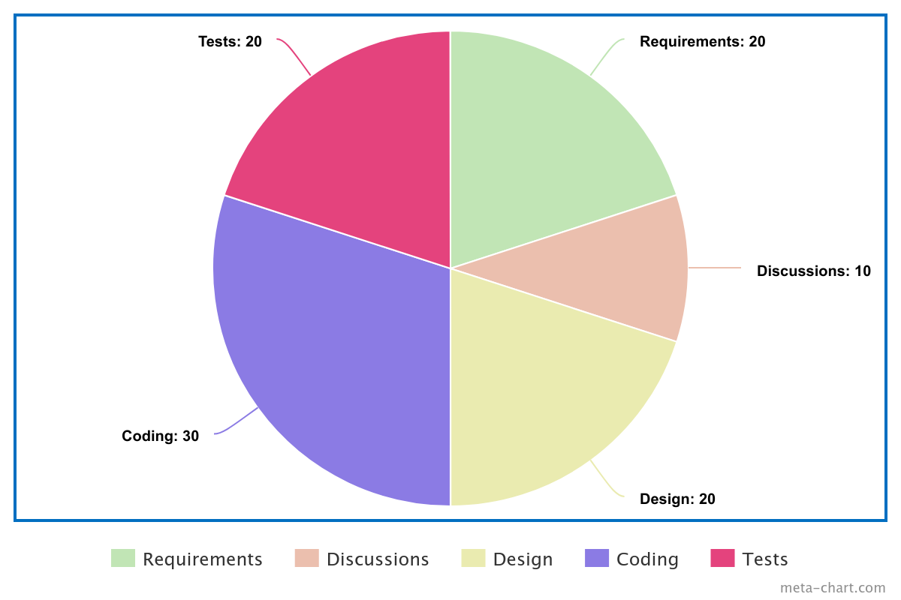

slidenumbers: true
autoscale: true

# Building a Copilot based on Gemini
### Artur Badretdinov

---

# Artur Badretdinov

Google Developer Expert,
Digital Nomad,
Director of Android Engineering at Squire

https://twitter.com/ArtursTwit
https://www.linkedin.com/in/gaket/

---

# A day of a Software Engineer

* Eat
* Code 
* Sleep
* Repeet

---

# Code

* Gathering requirements
* Heated discussions with the team
* Drafting a plan and code design
* Filling in the gaps
* Writing tests

---

^ A pie chart showing how the things above are split, with coding and testing taking like 50%

---

# Code copilots

* Write the basics
* Generate the rest

---

---

# Context Window

* Avg LLM has 30-60k token window, what's roughly 25-50k words
* Average project is around 500k tokens
* It doesn't fit!

---

# Workarounds

* Copy-paste different classes
* Work only on smallest parts that don't require external interfaces
* Chat with the model until it gets everything

---

# A Bright New World

* Increase context!
* Google Gemini 1.5
* 1 mln token context
* The whole project in the prompt

---

# Results

* Model knows all your model
* Project knowledge is great
* No Abstract Code Tree

^ TODO: update the tree name

---

# Costs

* ?

---

# Future

* Boilerplate is generated
* Working with people becomes more important
* Search on all codebase -> Codegen on all codebase

---

# Questions?