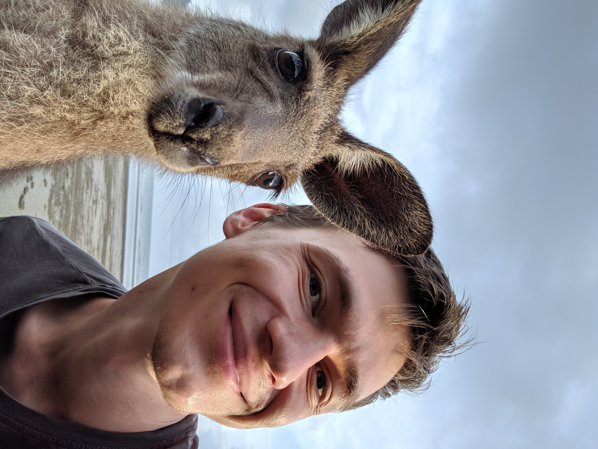
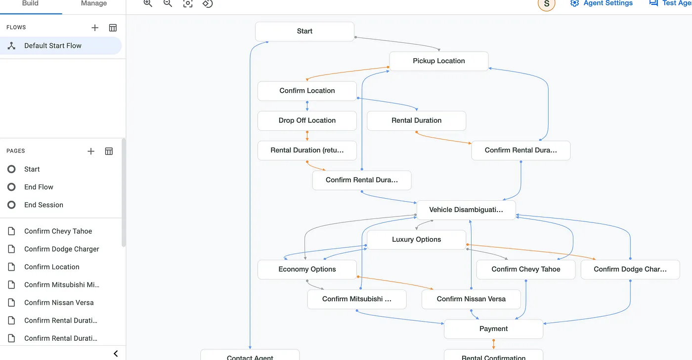
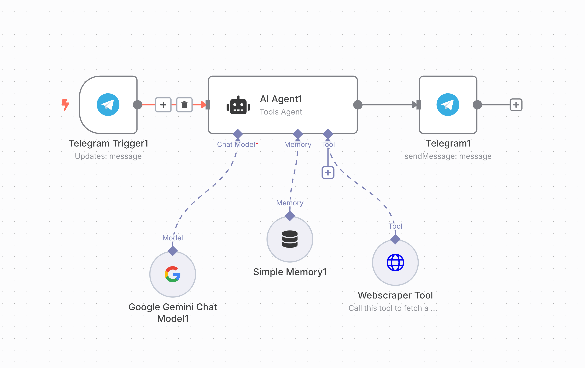

build-lists: true
slidenumbers: true
slidecount: true
slide-transition: true
autoscale: true

# Create your GenKit-based travel agent

### Artur Kuzmin

---

# Agenda

- Short intro
- Hands-on building the app!

---

# Goals

- Build a GenKit agent
- Play with prompts
- Deploy an app to cloud

---

# Artur Kuzmin

Director of Engineering at Squire,
Co-founder of Talent Agent
Google Developer Expert

Built 20+ agents in the last year.
5 of them are currently in production.

[linkedin.com/in/arturkuzmin/](linkedin.com/in/arturkuzmin/)
[twitter.com/ArtursTwit](twitter.com/ArtursTwit)

^ 5 prod: Tiktok, Cleaning Service booking, database chat, data purity chat, interview support

---

# Talent Agent 🎁

## Free 7-day resume building bootcamp.

#### https://a.gettalentagent.com/bootcamp/ar

---

# Introduction: What are AI Agents?

> AI Agents are software systems that can perform tasks autonomously or with minimal human intervention. They have access to tools to be able to interact with the outside world.

---

## AI Agents

- Get a goal.
- Plan how to achieve it.
- Use tools or other agents as needed.
- Decide when the goal was achieved.

---

---

---

# Free Google tools for AI

* AI Studio
* Firebase Studio
* Gemini CLI
* Firebase Gen Kit
* Agent Development Kit

---

# Free APIs! 🎉

1. Google Gemini. 15 RPM for fast model
2. Groq. 30 RPM. Mistral / LLama / Qwen / Deepseek distilled
3. Hugging Face. 1000 RPD. Qwen / Deepseek distilled

---

# Code Lab

1. https://firebase.google.com/codelabs/ai-genkit-rag
1. We'll use Gemini API instead of Vertex. No need for Fireabase paid plan, no need to Enable Vertex AI ~~gcloud services enable aiplatform.googleapis.com~~
1. Get api key here: https://aistudio.google.com/apikey
1. Run `npm install @genkit-ai/googleai`
1. Replace all `vertexai/gemini-2.5-flash` to `googleai/gemini-2.5-flash`
1. Use `googleAI.embedder('text-embedding-004',...),` in the retriever instead of  `vertexAI.embedder('gemini-embedding-001'`

---

# Did you like the talk?

Connect to me on LinkedIn!
And likes are always appreciated :)

[linkedin.com/in/arturkuzmin/](linkedin.com/in/arturkuzmin/)
[twitter.com/ArtursTwit](twitter.com/ArtursTwit)
[youtube.com: Artur Badretdinov](https://www.youtube.com/channel/UCITBqDpLM00WF_usfSJ97YA)

---

# Tech Learning Bonus

Do you want to get a deep dive how to move from LLM to Agents? Go through these examples:

https://github.com/ashishpatel26/AIAgentWorkshop/tree/main
