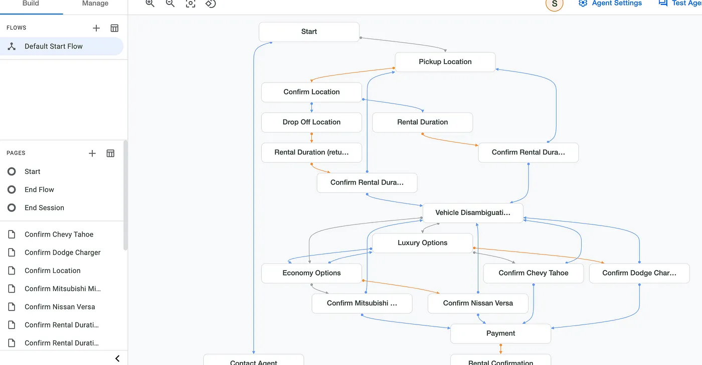
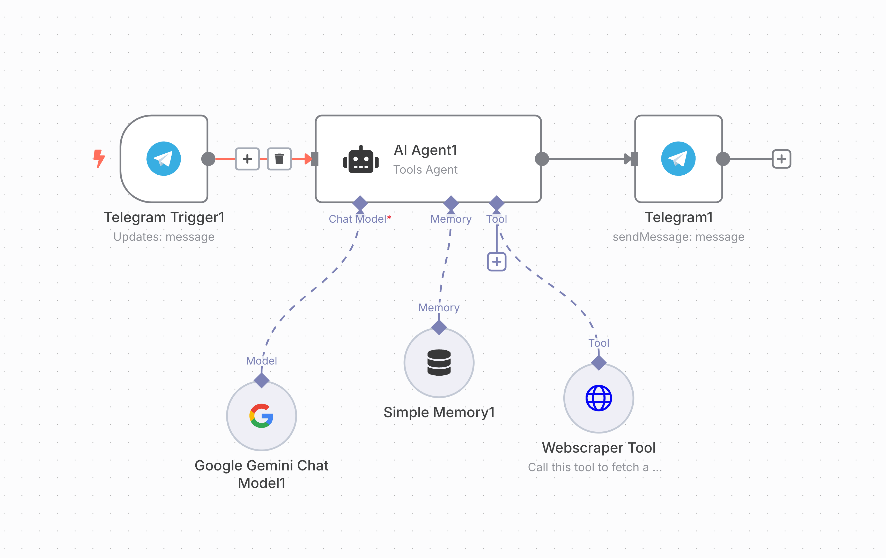
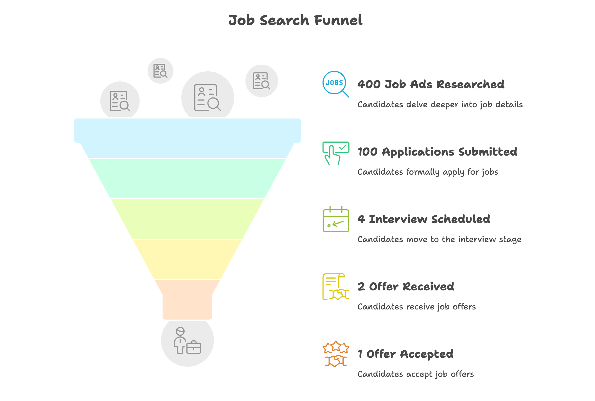

build-lists: true
slidenumbers: true
slidecount: true
slide-transition: true
autoscale: true

# How to create your AI Talent Agent

### Artur Kuzmin

* Where are you joining from?
* What's your goal for this talk?
* https://take.supersurvey.com/QGZD2XECS

---

# How to create your AI Talent Agent

### Artur Kuzmin

---

# Agents - iPhones?

 

^ iphone 1 on the left, iphone 3 on the right. 6 mln sales vs 60 mln

---

# Agenda

- LLMs in job search
- Agents vs Workflows
- A bit more technical stuff
- Job search tools
- Demos
- Bonus
- Q&A

---

# Goals

- Not a deep technical workshop
- Bring curiosity about agents
- Ideas of how can you make job search easier

---

# Artur Kuzmin

Director of Engineering at Squire,
Co-founder of Talent Agent
Google Developer Expert

Built 20+ agents in the last year.
5 of them are currently in production.

[linkedin.com/in/arturkuzmin/](linkedin.com/in/arturkuzmin/)
[twitter.com/ArtursTwit](twitter.com/ArtursTwit)

^ 5 prod: Tiktok, Cleaning Service booking, database chat, data purity chat, interview support

---

# Let's get agents some work in background

^ I want to build an app that will help me find my next role. For this I want the app to receive data about me such as a resume, LinkedIn, maybe some other social profiles. Then I want the app to be able to chat with me so there will be some agent. In the background that will be chatting with me so that we can collect all the information needed for applications. Then, I want the app to help me apply to roles I found somewhere on internet. Open the job, fill in my info. Ask me if there are some questions it can't answer to. Track my applications.

---

# Get an invite to Manus 🎁

Share your thoughts on LinkedIn / Twitter,
ping Artur Kuzmin,
get a chance to get an invite! :)

---

# Talent Agent 🎁

## Free 7-day resume building bootcamp.

### End of the talk 🎁: N8N flows + Talent Agent AI Beta

#### https://a.gettalentagent.com/bootcamp/ar

---

# From LLM to Agents

---

# Introduction: What are AI Agents?

> AI Agents are software systems that can perform tasks autonomously or with minimal human intervention. They have access to tools to be able to interact with the outside world.

---

# AI Agents evolution

1. LLM chat
2. Web search
2. Image / audio recognition
3. Other tooling
3. Autonomous task performing
3. Multi-agents

---

# Early Days of LLMs - Text Input/Output

^ Process text input and generate text output. Text completion and question answering. You're behind!

---

# Job search help?

- Ask an advice
- Role play
- Copy-paste your info and job description and chat about it

^ Chat: https://gemini.google.com/gem/ac3b7f174b65/53f9ba59427b8a3a

---

# Function Calling

---

## Advantages of Function Calling

- You've got a function? LLM can now use it.
- Search!
- Ability to call internal code
- Ability to call external APIs

---

## Job search help?

- Create a Gemini Gem / Custom GPT
- Let it use Search to find company info
- Upload your resume, copy-paste LinkedIn
- Ask chat to tailor resume / prepare a cover letter

^ https://gemini.google.com/gem/ac3b7f174b65/00d4c29ef1df0529

---

## AI Agents

- Get a goal.
- Plan how to achieve it.
- Use tools or other agents as needed.
- Decide, when the goal was achieved.

---

---

---

# Browser Use Agent

---

# Agents vs Workflows

* Agent - max autonomy
* Workflow - do X, Y, Z

---

# Understanding Workflows

- Workflows chain multiple LLM calls or decisions based on outputs from previous steps.
- Example: A router LLM deciding which specialized LLM or tool to use.
- Benefit: Offers flexibility without the unpredictability of autonomous agents.

---

# Strategic Choices: Agents vs. Workflows

## When to Use Agents vs. Workflows?

  * Predictability
  * Control
  * Boundaries/Complexity
  * Latency & Cost

^ - Assess the need for an agent by asking:
  - **Predictability:** Is the task structured and predictable? Use workflows for clear, step-by-step processes.
  - **Control:** Is consistent and guaranteed behavior critical? Workflows ensure strict control.
  - **Boundaries/Complexity:** Are problem boundaries well-defined? Workflows suit decomposable problems; agents handle open-ended reasoning.
  - **Latency & Cost:** Can the system tolerate higher latency and cost? Workflows are better for low latency and cost-sensitive tasks.
- Summary: "If you want predictability, control, clear boundaries, and low latency, use workflows."
N8N demo here!

---

# Building Effective AI Agents

---

# Frameworks for Building Agents

Prototype:
- N8N
- LangChain
- Firebase Gen Kit
- Google Agent Development Kit
- Crew AI
- SmolAgents

Build:
- Code

^Popular frameworks (e.g., Langraph, Crew AI, Autogen, Google/OpenAI Agent SDKs) are great for rapid prototyping.
Limitations:
  - Abstractions hide internal workings and reduce control.
  - Enforced design choices may lead to suboptimal systems.
Recommended approach:
  - Use frameworks for initial prototypes.
  - Gradually strip unnecessary abstractions and customize implementations.

---

# Best Practices in Building Agentic Systems

* Start simple
* Iterate based on observations
* Prioritize functionality over complexity
* Develop evaluation datasets

^ - Start Simple: Build and validate a single-agent system first.
- Iterate Based on Observations: Collect evaluation data sets (e.g., 10-15 examples initially).
- Prioritize Functionality Over Complexity: Avoid overengineering early.
- Develop Evaluation Data Sets: Continuously expand based on failures or missing functionality.

---

# Prompting Strategies for Agents

- Clarity is Critical
- Tool Descriptions Matter
- Error Analysis
- LLM Variations
- Use LLM Observability tools

^- Clarity is Critical: System prompts must be clear and specific. Provide detailed instructions and examples.
- Tool Descriptions Matter: Precise descriptions of parameters, inputs, and outputs are crucial for tool selection.
- Error Analysis: Refine tool descriptions or evaluate model capability if incorrect tools are selected.
- LLM Variations: Different LLMs may require different prompting styles.

---

# Observability in Agentic Systems

- Observability is critical for understanding and improving agent behavior.
- Tools like [Helicone.ai](https://helicone.ai) provide logging, tracing, and analysis for LLM calls and agent actions.
- Benefits include debugging, performance optimization, and cost management.

---

# Additional Notes & Considerations

- Limit the number of tools or ensure clear differentiation.
- Consider multi-agent systems or handoffs for complex tasks.

---

# Firebase Gen Kit and Firebase Studio

---

# Agent Development Kit

Agent or a workflow?
https://github.com/google/adk-samples/tree/main/agents

---

# Browser Agent Demo Use Cases

- Deep Research of a company
- Creating activity on LinkedIn
- Connecting to people with a lot of followers
- Finding you the best deal for a laptop on Facebook Marketplace
- Booking a time slot at DriveTest or a country embassy
- Apply for jobs on your behalf

---

# MCP - chat with other systems

https://github.com/firebase/genkit/tree/main/js/plugins/mcp

* mcpmarket.com — A plug-and-play directory of MCP servers for tools like GitHub, Figma, Notion, Databricks, and more.
* mcp.so — A growing open repo of community-built MCP servers. Discover one. Fork it. Build your own.
* Cline’s MCP Marketplace — A GitHub-powered hub for open-source MCP connectors anyone can use.

---

# A2A - Agent to Agent

https://developers.googleblog.com/en/a2a-a-new-era-of-agent-interoperability/

---

---

# Good news, Bad news

* It's hard to build a real-world product
* It's easy to build a small helper

---

# Creating your Agent(s)

* Agents, not agent
* Quality vs quantity
* There is no one-fits-all

---

# Creating an agent

1. Chat with an LLM
2. Analyze what takes the most energy
3. Use the tools you're most comfortable with

---

# Building a Talent Agent

- Non-technical but want to have something working?

    - Use Gemini / ChatGPT + Browser Use

- Somewhat technical?

    - UI builders + N8N / Firebase Gen Kit
    - Telegram bot + N8N

- Software Engineers?

    - Agentic frameworks
    - Direct code

---

# Or... Existing Tools?

* [Talent Agent](gettalentagent.com)
* LoopCV [Lifetime link](https://www.loopcv.pro/)
* Hiring Cafe
* JobRight
* Magical
* Simplii

---

# Let's be mindful

* ~Brut force Automation~
* AI-assisted search
* Smart Automation
* Come prepared!

^ Come prepared!

---

# Arms race

* AI screening tools
* AI assessment tools
* Eg: Potis.ai, Mercor, Apriora

^ Btw, let me know if you hire someone, I can get you a sweet discount

----

# Next steps at your job search

* Quick results? Existing tooling
* Get new skills and have time? Build an agent

---

# Future

* Industrialization
* Cars
* Planes
* Computer
* Internet
* Generative AI and Agents

---

# 🎁 Bonus

* N8N flow to better prep for an interview
* 10 seats - free access to Talent Agent Beta

---

# Free APIs! 🎉

1. Google Gemini. 15 RPM for fast model
2. Groq. 30 RPM. Mistral / LLama / Qwen / Deepseek distilled
3. Hugging Face. 1000 RPD. Qwen / Deepseek distilled

---

# Practice

1. Generate Gemini API key: https://aistudio.google.com
2. Go through [Genkit codelab](https://firebase.google.com/codelabs/ai-genkit-rag)
2. Create [SmollAgents CodeAgent](https://huggingface.co/docs/smolagents/en/guided_tour) with network access and Gemini as an LLM
3. Create [Browser Use agent](https://docs.browser-use.com/introduction) that would work with a browser on your behalf

---

# Did you like the talk?

Connect to me on LinkedIn!
And likes are always appreciated :)

[linkedin.com/in/arturkuzmin/](linkedin.com/in/arturkuzmin/)
[twitter.com/ArtursTwit](twitter.com/ArtursTwit)
[youtube.com: Artur Badretdinov](https://www.youtube.com/channel/UCITBqDpLM00WF_usfSJ97YA)

---

# Tech Learning Bonus

Do you want to get a deep dive how to move from LLM to Agents? Go through these examples:

https://github.com/ashishpatel26/AIAgentWorkshop/tree/main
